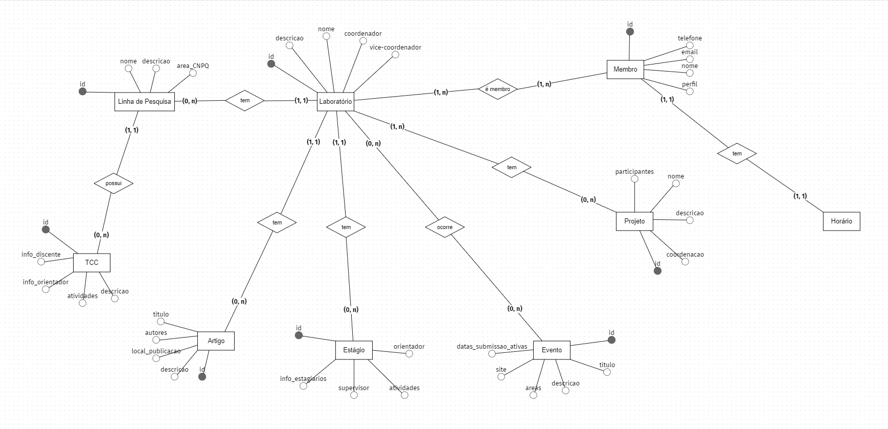

# Documento de Modelos

## Modelo de Dados

### Modelo ER feito no BrModeloWeb

## Dicionário de Dados

|   Tabela   | Laboratório |
| ---------- | ----------- |
| Descrição  | Armazena as informações de um laboratório acadêmico. |
| Observação | Laboratórios acadêmicos podem ser de Ensino, Pesquisa, Extensão, P&D, etc. |

|  Nome         | Descrição                        | Tipo de Dado | Tamanho | Restrições de Domínio |
| ------------- | -------------------------------- | ------------ | ------- | --------------------- |
| id        | identificador gerado pelo SGBD   | SERIAL       | ---     | PK / Identity |
| nome          | nome do laboratório              | VARCHAR      | 150     | Not Null |
| descricao     | detalhes sobre o laboratório     | VARCHAR      | 250     | --- |
| coordenador     | membro coordenador vinculado ao lab     | INT      | ---    | FK/ Not Null |
| vice-coordenador     | membro vice-coordenador vinculado ao lab     | INT      | ---    | FK |